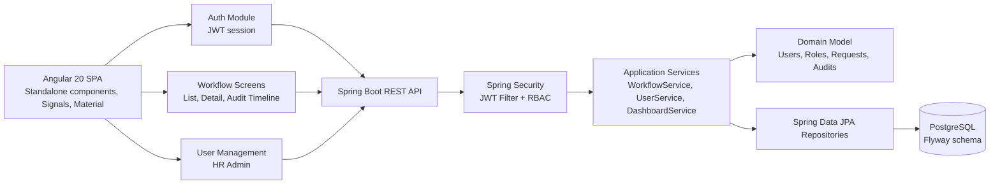
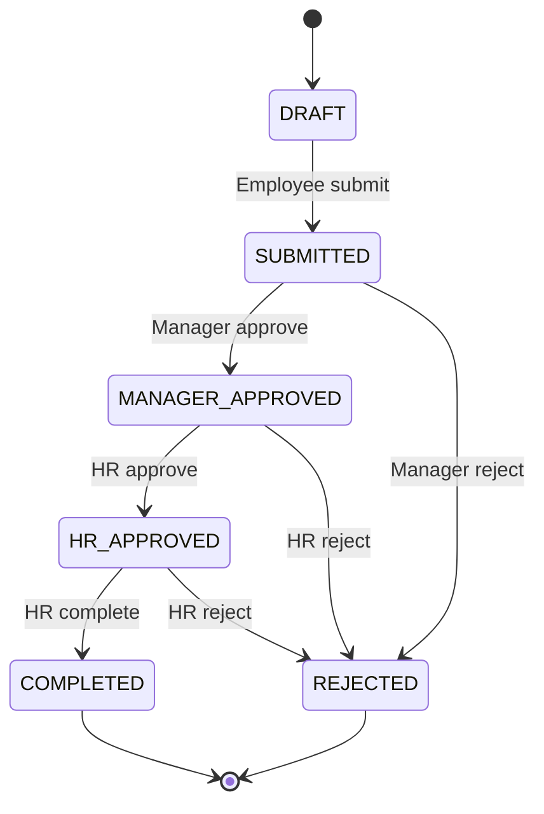

# FlowForge Architecture

FlowForge is structured as a reusable workflow foundation: role-based users perform state transitions, every transition produces an immutable audit entry, and the UI consumes typed REST contracts.

## Backend Boundaries

- `domain`: workflow statuses, actions, roles, and JPA-backed business entities.
- `application`: use-case services for authentication, users, dashboards, and workflow transitions.
- `repository`: Spring Data persistence contracts.
- `security`: JWT generation, authentication filter, and `UserPrincipal`.
- `web`: controllers, DTOs, and API error handling.
- `config`: security configuration and seed data.

## Workflow State Machine

